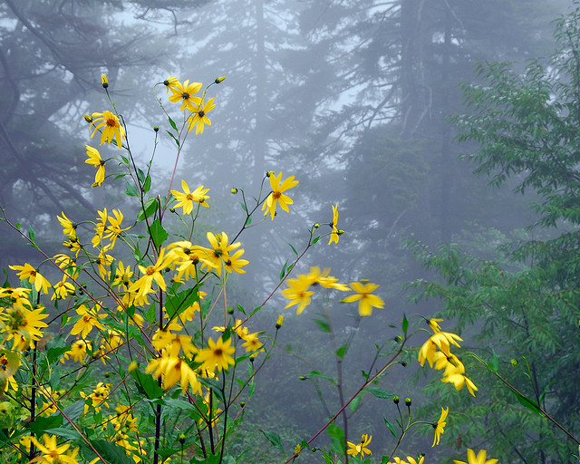

# Real-time haze removal in monocular images using locally adaptive processing

[V. H. Diaz-Ramirez](https://orcid.org/0000-0002-9331-1777), [J. E. Hernandez-Beltran](https://orcid.org/0000-0002-7043-3093), [Rigoberto Juarez-Salazar](https://orcid.org/0000-0001-6917-7558)

Paper Link: [DOI:10.1007/s11554-017-0698-z](https://doi.org/10.1007/s11554-017-0698-z)

Paper Abstract:
This research presents the design of a real-time system to remove the effects of haze in a sequence of monocular images. The system firstly estimates the medium transmission function from an observed hazy image using locally adaptive neighborhoods and calculation of order statistics. Next, the haze-free image is retrieved using the estimated transmission function and a physics-based restoration model. The performance of the proposed system is evaluated and compared with that of similar existing techniques in terms of objective metrics. The obtained results exhibit that the proposed system yields a higher performance in comparison with tested similar methods. Because of its high computational efficiency, the proposed system is able to operate at high rate and it is suitable for real-time applications.

Please cite this paper as follows (Bibtex citation):

	@article{Diaz-Ramirez2017,		
	  title = "Real-time haze removal in monocular images using locally adaptive processing",
	  author = "Diaz-Ramirez, V. H. and Hernandez-Beltran, J. E. and Juarez-Salazar, R."
	  journal = "Journal of Real-Time Image Processing",
	  year = "2017",
	} 

## Example

         

## Prerequisites
Python 3

Install python packages: 
   opencv-contrib-python, numpy, scipy, scikit-image

## Usage
### To test the estimators GP-SD and GP-SN
	python GPStatistics.py   

### To test the estimators GP-PD and GP-PN
	python GPPixels.py   
	
NOTE: Read comments in the source file to select the estimators and modify parameters	
